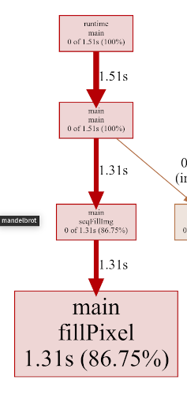

```
High Performance Go Workshop

1. Benchmarking
2. Performance measurement and profiling
3. Compiler optimisations
4. Execution Tracer

    4.1. What is the execution tracer, why do we need it?
    4.2. Generating the profile
    4.3. Generating a profile with runtime/pprof
    4.4. Tracing vs Profiling
    4.5. Using more than one CPU
    4.6. Batching up work
    4.7. Using workers
    4.8. Using buffered channels
    4.9. Mandelbrot microservice

5. Memory and Garbage Collector
6. Tips and trips

Dave Cheney dave@cheney.net (v379996b, 2019-07-24)
```

# 4. Execution Tracer

The execution tracer is integrated into the Go runtime.
- It does know `what` a Go program is doing at a particular point in time `and why`.

----

## 4.1 What is the execution tracer, why do we need it?

I think it is easiest to explain what the execution tracer does, and why it's important by looking at a piece of code where the `pprof, go tool pprof` performs poorly.

The `examples/mandelbrot` directory contains a simple mandelbrot generator.

This code is derived from Francesc Campoy’s [mandelbrot package](https://github.com/campoy/mandelbrot).

```sh
cd examples/mandelbrot
go build && ./mandelbrot
```
If we build it, then run it, it generates something like this


----

### 4.1.1. How long does it take?

So, how long does this program take to generate a 1024 x 1024 pixel image?

The simplest way I know how to do this:

```sh
time ./mandelbrot

real	0m1,531s
user	0m1,539s
sys	0m0,000s
```

> Don't use **time go run mandebrot.go** or you'll time how long it takes to compile the program as well as run it.

----

### 4.1.2. What is the program doing?

So, in this example the program took **1.5 seconds** to generate the mandelbrot and write to a png.

- Is that good?
- Could we make it faster?

One way to answer that question would be to use Go's built in `pprof` support to profile the program.

## 4.2 Generating the profile

To turn generate a profile we need to either

- Use the `runtime/pprof` package directly.
- Use a wrapper like `github.com/pkg/profile` to automate this.

## 4.3 Generating a profile with runtime/pprof

To show you that there's no magic, let's modify the program to write a **CPU profile** to `os.Stdout`.

```go
import "runtime/pprof"

func main() {
	pprof.StartCPUProfile(os.Stdout)
    defer pprof.StopCPUProfile()
}
```

By adding this code to the top of the main function, this program will write a profile to `os.Stdout`.

```sh
cd examples/mandelbrot-runtime-pprof
go run mandelbrot.go > cpu.pprof # okay here as well
```

> We can use `go run` in this case because the cpu profile will only include the execution of `mandelbrot.go`, not its compilation. 

----

### 4.3.1. Generating a profile with github.com/pkg/profile

The previous slide showed a super cheap way to generate a profile, but it has a few problems.
- If you forget to **redirect the output to a file** then you'll blow up that terminal session.
- If you write anything else to `os.Stdout`, for example, `fmt.Println` you'll **corrupt the trace**.

The recommended way to use `runtime/pprof` is to [write the trace to a file](https://godoc.org/runtime/pprof#hdr-Profiling_a_Go_program). But, then you have to make sure the trace is stopped, and file is closed before your program stops, including if someone `^C`'s it.

I wrote a [package](https://godoc.org/github.gom/pkg/profile) to take care of it.

```go
import "github.com/pkg/profile"

func main() {
    defer profile.Start(profile.CPUProfile, profile.ProfilePath(".")).Stop()
}
```
If we run this version, we get a profile written to the current working directory

```sh
go run mandelbrot.go

profile: cpu profiling enabled, cpu.pprof
profile: cpu profiling disabled, cpu.pprof
# ls
  2085 dec 19 cpu.pprof
  2728 dec 19 mandelbrot.go
532406 dec 19 mandelbrot.png
```

> Using `pkg/profile` is not mandatory, but it takes care of a lot of the boilerplate around collecting and recording traces, so we’ll use it for the rest of this workshop.

----

### 4.3.2. Analysing the profile

Now we have a profile, we can use `go tool pprof` to analyse it.

```sh
go tool pprof cpu.pprof
```

> Since Go 1.9 the pprof trace contains all the information you need to analyse the trace.
>
> You no longer need to also have the matching binary which produced the trace. 🎉

We can use the `top` pprof function to sort functions recorded by the trace.

- In this run we see that the program ran for 1.70s seconds - `profiling adds a small overhead`.
- We can also see that **pprof** only captured data for 1.51 seconds
- That is because pprof is **sample based**, relying on the operating system's `SIGPROF` timer.


```sh
go tool pprof cpu.pprof
File: mandelbrot
Type: cpu
Time: Dec 19, 2020
Duration: 1.70s, Total samples = 1.51s (88.64%)
(pprof) top
Showing nodes accounting for 1.50s, 99.34% of 1.51s total
Showing top 10 nodes out of 30
      flat  flat%   sum%        cum   cum%
     1.31s 86.75% 86.75%      1.31s 86.75%  main.fillPixel
     0.03s  1.99% 88.74%      0.06s  3.97%  compress/flate.(*compressor).findMatch
     0.03s  1.99% 90.73%      0.03s  1.99%  compress/flate.matchLen
```

We see that the `main.fillPixel` function was **on the CPU the most** when pprof captured the stack.

We can also add the `cummulative` flag to `top`.

```sh
(pprof) top5 -cum
Showing nodes accounting for 1310ms, 86.75% of 1510ms total
Showing top 5 nodes out of 30
      flat  flat%   sum%        cum   cum%
         0     0%     0%     1500ms 99.34%  main.main
         0     0%     0%     1500ms 99.34%  runtime.main
    1310ms 86.75% 86.75%     1310ms 86.75%  main.fillPixel
         0     0% 86.75%     1310ms 86.75%  main.seqFillImg
         0     0% 86.75%      190ms 12.58%  image/png.(*Encoder).Encode
```

This is sort of suggesting that `main.fillPixed` is actually **doing most of the work**.

You can also visualise the profile in a **web browser**:

```sh
go tool pprof -http=:8080 cpu.pprof
```



----

## 4.4 Tracing vs Profiling

Hopefully this example shows the limitations of profiling. 

Profiling told us what the profiler saw; `fillPixel` was doing all the work. There didn’t look like there was much that could be done about that.

So now it’s a good time to introduce the **execution tracer** which gives a **different view** of the same program.

----

### 4.4.1. Using the execution tracer

Using the tracer is as simple as asking for a `profile.TraceProfile`, nothing else changes.

```sh
import "github.com/pkg/profile"

func main() {
	defer profile.Start(profile.TraceProfile, profile.ProfilePath(".")).Stop()
}
```

When we run the program, we get a `trace.out` file in the current working directory.

```sh
cd mandelbrot-trace && go build mandelbrot.go

time ./mandelbrot
profile: trace enabled, trace.out
profile: trace disabled, trace.out

real	0m1,528s
user	0m1,522s
sys	0m0,016s
```

Just like pprof, there is a tool in the `go` command to analyse the trace.

```sh
go tool trace trace.out

Parsing trace...
Splitting trace...
Opening browser. Trace viewer is listening on http://127.0.0.1:41377
```

The execution tracer is reusing a lot of the profile visualisation infrastructure built into **Chrome**.

- `go tool trace` acts as a server to **translate the raw execution trace** into data which Chome can display natively.

- Because this is a Google product, it supports keyboard shortcuts; use `WASD` to navigate, use `?` to get a list.
- Viewing traces can take a lot of memory. Seriously, 4Gb won't cut it, 8Gb is probably the minimum, more is definitely better.
- The tool uses the javascript debugging support built into Chrome.
- Trace profiles can only be viewed in Chrome, they won’t work in Firefox, Safari, IE/Edge.

----

### 4.4.2. Analysing the trace

We can see from the trace that the program is **only using one cpu**.

```go
func seqFillImg(m *img) {
	for i, row := range m.m {
		for j := range row {
			fillPixel(m, i, j)
		}
	}
}
```

This isn’t a surprise, by default mandelbrot.go calls fillPixel for each pixel in each row in sequence.

Once the image is painted, see the execution switches to writing the .png file. This generates garbage on the heap, and so the trace changes at that point, we can see the classic saw tooth pattern of a garbage collected heap.

The trace profile offers timing resolution down to the microsecond level. This is something you just can’t get with external profiling.

----

## 4.5 Using more than one CPU

Mandelbrot generation is known as embarassingly_parallel. Each pixel is independant of any other, they could all be computed in parallel. So, let’s try that.

```sh
time ./mandelbrot -mode px
2020/12/20 00:04:16 profile: trace enabled, trace.out
2020/12/20 00:04:17 profile: trace disabled, trace.out

real	0m1,391s
user	0m7,336s
sys	0m0,301s
```

So the runtime was basically the same. There was more user time, which makes sense, we were using all the CPUs, but the real `(wall clock)` time was about the same.

As you can see this trace generated much more data.
- It looks like lots of work is being done, but if you zoom right in, there are gaps. This is believed to be the scheduler.
- While we’re using all four cores, because each fillPixel is a relatively small amount of work, we’re spending a lot of time in scheduling overhead.

```sh
go tool trace trace.out
```

## 4.6 Batching up work

Using one goroutine per pixel was too fine grained. There wasn’t enough work to justify the cost of the goroutine.

Instead, let’s try processing one row per goroutine.

```sh
time ./mandelbrot -mode row

2020/12/20 00:19:20 profile: trace enabled, trace.out
2020/12/20 00:19:21 profile: trace disabled, trace.out

real	0m0,336s
user	0m1,733s
sys	0m0,009s
```
This looks like a good improvement, we almost halved the runtime of the program. Let’s look at the trace.

```sh
go tool trace trace.out
```


As you can see the trace is now smaller and easier to work with. We get to see the whole trace in span, which is a nice bonus.
- At the start of the program we see the number of goroutines ramp up to around 1,000. This is an improvement over the 1 << 20 that we saw in the previous trace.
- Zooming in we see onePerRowFillImg runs for longer, and as the goroutine producing work is done early, the scheduler efficiently works through the remaining runnable goroutines.

## 4.7 Using workers

```sh
time ./mandelbrot -mode workers

2020/12/20 00:28:07 profile: trace enabled, trace.out
2020/12/20 00:28:09 profile: trace disabled, trace.out

real	0m1,552s
user	0m1,545s
sys	0m0,012s
```

Looking at the trace you can see that with only one worker process the producer and consumer tend to alternate because there is only one worker and one consumer. Let’s increase the number of workers

```sh
time ./mandelbrot -mode workers -workers 4
2020/12/20 00:31:05 profile: trace enabled, trace.out
2020/12/20 00:31:06 profile: trace disabled, trace.out

real	0m0,557s
user	0m1,586s
sys	0m0,008s
```

That trace is a mess. There were more workers available, but the seemed to spend all their time fighting over the work to do.

This is because the channel is **unbuffered**. An unbuffered channel cannot send until there is someone ready to receive.
- The producer cannot send work until there is a worker ready to receive it.
- Workers cannot receive work until there is someone ready to send, so they compete with each other when they are waiting.
- The sender is not privileged, it cannot take priority over a worker that is already running.

What we see here is **a lot of latency introduced by the unbuffered channel**. There are lots of stops and starts inside the scheduler, and potentially locks and mutexes while waiting for work, this is why we see the sys time higher.

----

## 4.8 Using buffered channels

```sh
cd mandelbrot-buffered && go build mandelbrot.go

time ./mandelbrot -mode workers -workers 4
2020/12/20 00:42:40 profile: trace enabled, trace.out
2020/12/20 00:42:41 profile: trace disabled, trace.out

real	0m0,613s
user	0m1,889s
sys	0m0,033s
```

Using a buffered channel the trace showed us that:
- The producer doesn’t have to wait for a worker to arrive, it can fill up the channel quickly.
- The worker can quickly take the next item from the channel without having to sleep waiting on work to be produced.

Using this method we got nearly the same speed using a channel to hand off work per pixel than we did previously scheduling on goroutine per row.

> Modify nWorkersFillImg to work per row. An time the result and analyse the trace.

----

## 4.9 Mandelbrot microservice

It’s 2019, generating Mandelbrots is pointless unless you can offer them on the internet as a serverless microservice.

Thus, I present to you, Mandelweb

```sh
go run examples/mandelweb/mandelweb.go
```

http://127.0.0.1:8080/mandelbrot

### 4.9.1 Tracing running applications

As you saw, traces can be very large, even for small amounts of time, so collecting trace data continually would generate far too much data. Also, tracing can have an impact on the speed of your program, especially if there is a lot of activity.

What we want is a way to collect a short trace from a running program.

Fortuntately, the `net/http/pprof` package has just such a facility.

### 4.9.2 Collecting traces via http

Hopefully everyone knows about the net/http/pprof package.

```go
import _ "net/http/pprof"
```

> If you are using that ServeMux implicitly, or explicitly, you may inadvertently expose the pprof endpoints to the internet. This can lead to source code disclosure. You probably don’t want to do this.

We can grab a five second trace from mandelweb with curl (or wget)

```sh
curl -o trace.out http://127.0.0.1:8080/debug/pprof/trace?seconds=5
go tool trace trace.out
```

----

### 4.9.3 Generating some load

The previous example was interesting, but an idle webserver has, by definition, no performance issues. We need to generate some load.

```sh
GO111MODULE=on go get -u github.com/rakyll/hey
# Let’s start with one request per second | 1 worker | 1000 requests.
$(go env GOPATH)/bin/hey -c 1 -n 1000 -q 1 http://127.0.0.1:8080/mandelbrot

# And with that running, in another window collect the trace
curl -o trace.out http://127.0.0.1:8080/debug/pprof/trace?seconds=5
go tool trace trace.out
```

### 4.9.4 Simulating overload

```sh
# Let’s increase the rate to 5 requests per second | 5 workers | 1000 requests.
$(go env GOPATH)/bin/hey -c 5 -n 1000 -q 5 http://127.0.0.1:8080/mandelbrot
#----
curl -o trace.out http://127.0.0.1:8080/debug/pprof/trace?seconds=5
go tool trace trace.out
```

---

### 4.9.5 Extra credit, the Sieve of Eratosthenes

The [concurrent prime sieve](https://github.com/golang/go/blob/master/doc/play/sieve.go) is one of the first Go programs written.

Ivan Daniluk wrote a [great post on visualising](https://divan.dev/posts/go_concurrency_visualize/) it.

Let’s take a look at its operation using the execution tracer.

```go
// A concurrent prime sieve
package main

import (
	"fmt"

	"github.com/pkg/profile"
)

// Generate sends the sequence 2, 3, 4, ... to channel 'ch'.
func Generate(ch chan<- int) {
	for i := 2; ; i++ {
		ch <- i // Send 'i' to channel 'ch'.
	}
}

// Filter copies the values from channel 'in' to channel 'out',
// removing those divisible by 'prime'.
func Filter(in <-chan int, out chan<- int, prime int) {
	for {
		i := <-in // Receive value from 'in'.
		if i%prime != 0 {
			out <- i // Send 'i' to 'out'.
		}
	}
}

// The prime sieve: Daisy-chain Filter processes.
func main() {
	defer profile.Start(profile.TraceProfile, profile.ProfilePath(".")).Stop()
	ch := make(chan int) // Create a new channel.
	go Generate(ch)      // Launch Generate goroutine.
	for i := 0; i < 10; i++ {
		prime := <-ch
		fmt.Println(prime)
		ch1 := make(chan int)
		go Filter(ch, ch1, prime)
		ch = ch1
	}
}

```

```sh
time ./sieve
2020/12/20 01:30:08 profile: trace enabled, trace.out
2
3
5
7
11
13
17
19
23
29
2020/12/20 01:30:08 profile: trace disabled, trace.out

real	0m0,009s
user	0m0,010s
sys	0m0,005s
```

----

### 4.9.6 More resources

<ul>
<li>
<p>Rhys Hiltner, <a href="https://www.youtube.com/watch?v=mmqDlbWk_XA">Go’s execution tracer</a> (dotGo 2016)</p>
</li>
<li>
<p>Rhys Hiltner, <a href="https://www.youtube.com/watch?v=V74JnrGTwKA">An Introduction to "go tool trace"</a> (GopherCon 2017)</p>
</li>
<li>
<p>Dave Cheney, <a href="https://www.youtube.com/watch?v=2h_NFBFrciI">Seven ways to profile Go programs</a> (GolangUK 2016)</p>
</li>
<li>
<p>Dave Cheney, <a href="https://dave.cheney.net/training#high-performance-go">High performance Go workshop</a></p>
</li>
<li>
<p>Ivan Daniluk, <a href="https://www.youtube.com/watch?v=KyuFeiG3Y60">Visualizing Concurrency in Go</a> (GopherCon 2016)</p>
</li>
<li>
<p>Kavya Joshi, <a href="https://www.youtube.com/watch?v=KBZlN0izeiY">Understanding Channels</a> (GopherCon 2017)</p>
</li>
<li>
<p>Francesc Campoy, <a href="https://www.youtube.com/watch?v=ySy3sR1LFCQ">Using the Go execution tracer</a></p>
</li>
</ul>

- GopherCon 2019: Daniel Marti - Optimizing Go Code Without a Blindfold https://www.youtube.com/watch?v=oE_vm7KeV_E
   - https://docs.google.com/presentation/d/1cUVp8OuzOW4lzClsiptgacW7nSFkcgvhLRVAOgVPpYg/edit#slide=id.g550f852d27_228_0

----

(Compiler optimisations) [prev](03-Compiler-optimisations.md) | [next]() 