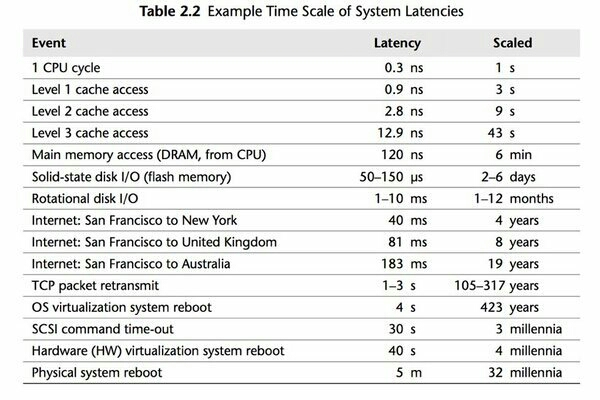

```
High Performance Go Workshop

1. Benchmarking
2. Performance measurement and profiling
3. Compiler optimisations
4. Execution Tracer
5. Memory and Garbage Collector
6. Tips and trips

    6.1. Goroutines
    6.2. Go uses efficient network polling for some requests
    6.3. Watch out for IO multipliers in your application
    6.4. Use streaming IO interfaces
    6.5. Timeouts, timeouts, timeouts
    6.6. Defer is expensive, or is it?
    6.7. Make the fast path inlinable
    6.8. Range
    6.9. Avoid Finalisers
    6.10. Minimise cgo
    6.11. Always use the latest released version of Go
    6.12. Discussion

Dave Cheney dave@cheney.net (v379996b, 2019-07-24) 
```

# 6. Tips and trips

This final section contains a number of tips to micro optimise Go code.

## 6.1 Goroutines

The key feature of Go that makes it a great fit for modern hardware are goroutines.

`Goroutines` are so easy to use, and so cheap to create, you could think of them as `almost free`.

The **Go runtime has been written for programs**: 
- with `tens of thousands of goroutines as the norm`, 
- hundreds of thousands are not unexpected.

However, `each goroutine does consume` a minimum amount of `memory for the goroutine's stack` which is currently `at least 2k`.

`2048 * 1,000,000 goroutines` => `2GB of memory`, and they haven't done anything yet.

Maybe this is a lot, maybe it isn't given the other usages of your application.

----

### 6.1.1 Know when to stop a goroutine

`Goroutines are cheap to start and cheap to run`, but they do have a `finite cost in terms of memory footprint`; you cannot create an infinite number of them.

**Every time you use the `go keyword` in your program to launch a goroutine, you must know `how, and when, that goroutine will exit`**.

In your design, some goroutines may run until the program exits. These goroutines are rare enough to not become an exception to the rule.

`Never start a goroutine without knowing how it will stop`:

- If you don't know the answer, that's a `potential memory leak`,
- as the goroutine will pin its stack's memory on the heap,
- as well as any heap allocated variables reachable from the stack

----

### 6.1.2 Further reading

- [Concurrency Made Easy](https://www.youtube.com/watch?v=yKQOunhhf4A&index=16&list=PLq2Nv-Sh8EbZEjZdPLaQt1qh_ohZFMDj8) video (GopherCon Singapure 2017)
- [Concurrency Made Easy](https://dave.cheney.net/paste/concurrency-made-easy.pdf) slides
- [Never start a goroutine without knowning when it will stop](https://dave.cheney.net/practical-go/presentations/qcon-china.html#_never_start_a_goroutine_without_knowning_when_it_will_stop) (Practical Go, QCon Shanghai 2018)

----

## 6.2 Go uses efficient network polling for some requests

The Go runtime handles `network IO` using an **efficient operating system polling mechanism** (kqueue, epoll, windows IOCP, etc).

Many waiting goroutines will be serviced by a **single OS thread**.

However, for local `file IO`, **Go does not implement any IO polling**.

**Each operation** on a `*os.File` **consumes one OS thread** while in progress.

Heavy use of local file IO can cause your program to spawn hundreds or thousands of threads; possibly more than your operating system allows.

Your disk subsystem does not expect to be able to handle hundreds or thousands of concurrent IO requests.

> To limit the amount of **concurrent blocking IO**,
> - use a **pool** of worker goroutines,
> - or a **buffered channel** as a semaphore.
>
> ```go
> var semaphore = make(chan struct{}, 10)
> 
> func processRequest(work *Work) {
> 	semaphore <- struct{}{} // acquire semaphore
> 	// process request
> 	<-semaphore // release semaphore
> }
> ```
>

----

## 6.3 Watch out for IO multipliers in your application

If memory is slow — relatively speaking — then IO is so slow that you should avoid doing it at all costs.

Most importantly **avoid doing IO in the context of a request**:
- `don't make the user wait for your disk subsystem to write to disk, or even read`.



----

## 6.4 Use streaming IO interfaces

Where-ever possible `avoid` **reading data into a** `[]byte` **and passing it around**.

Depending on the request you may end up **reading megabytes (or more!) of data into memory**.

This places huge **pressure on the GC**, which will increase the average **latency** of your application.

Instead use `io.Reader` and `io.Writer` to construct **processing pipelines** to cap the amount of memory in use per request.

For efficiency, **consider implementing** `io.ReaderFrom / io.WriterTo` **if you use a lot of `io.Copy`**.

These interfaces are **more efficient** and **avoid copying memory into a temporary buffer**.

----

## 6.5 Timeouts, timeouts, timeouts

> Never start an IO operating without knowing the maximum time it will take.

You need to **set a timeout on every network request** you make with `SetDeadline, SetReadDeadline, SetWriteDeadline`.

## 6.6 Defer is expensive, or is it?

In Go 1.13 defer records are optimisitically stack allocated.

This doesn’t remove the overhead of defer's closure, but it does remove the overhead of the heap allocation of the closure.

`defer` is **expensive if the work being done is small**,
- the classic example is defer' ing a mutex unlock around a struct variable or map lookup.
- `example/mutex`

This is a case where **readability and maintenance is sacrificed for a performance win**.

You may choose to avoid defer in those situations. Always revisit these decisions.

## 6.7 Make the fast path inlinable

> Mid stack inlining can be used to inline the fast path of a function, eliminating the function call overhead in the fast path.

The size of a function, it’s complexity, affects the ability of the compiler to inline it.

Mid stack inlining can be used to exploit this to make the fast path of a function inlinable.

[Example: go-review/src/sync/mutex.go](https://go-review.googlesource.com/c/go/+/148959/14/src/sync/mutex.go)

## 6.8 Range

Which of these benchmarks will run the fastest?

```go
func BenchmarkRangeValue(b *testing.B) {
	var r int
	for n := 0; n < b.N; n++ {
		for _, x := range X {
			r += x.val
		}
	}
	Result = r
}

func BenchmarkRangeIndex(b *testing.B) {
	var r int
	for n := 0; n < b.N; n++ {
		for i := range X {
			x := &X[i]
			r += x.val
		}
	}
	Result = r
}

func BenchmarkFor(b *testing.B) {
	var r int
	for n := 0; n < b.N; n++ {
		for i := 0; i < len(X); i++ {
			x := &X[i]
			r += x.val
		}
	}
	Result = r
}
```

Run the benchmark? We’re you correct?

```sh
# go test -benchmem -run=^$ -bench ./examples/range
BenchmarkRangeValue-12    	      74	  16032854 ns/op	       0 B/op	       0 allocs/op
BenchmarkRangeIndex-12    	    8948	    114908 ns/op	       0 B/op	       0 allocs/op
BenchmarkFor-12           	   10000	    114137 ns/op	       0 B/op	       0 allocs/op
```

> Exercise: using the tools we’ve discussed today, figure out why BenchmarkRange is slower than BenchmarkFor

## 6.9 Avoid Finalisers

Finalisation is a technique to attach behaviour to an object which is just about to be garbage collected.

- For a finaliser to run, the object must not be reachable by anything.
- If you accidentally keep a reference to the object in the map, it won’t be finalised.

Finalisers run as part of the gc cycle, which means it is unpredictable when they will run and puts them at odds with the goal of reducing gc operation.

A finaliser may not run for a long time if you have a large heap and have tuned your appliation to create minimal garbage.

## 6.10 Minimise cgo

cgo allows Go programs to call into C libraries.

C code and Go code live in two different universes, cgo traverses the boundary between them.

This transition is not free and depending on where it exists in your code, the cost could be substantial.

> cgo calls are similar to blocking IO, they consume a thread during operation.

> Do not call out to C code in the middle of a tight loop.

### 6.10.1 Actually, maybe avoid cgo

cgo has a high overhead.

For best performance I recommend avoiding cgo in your applications.

- If the C code takes a long time, cgo overhead is not as important.
- If you’re using cgo to call a very short C function, where the overhead is the most noticeable, rewrite that code in Go — by definition it’s short.
- If you’re using a large piece of expensive C code that is called in a tight loop, why are you using Go?

Is there anyone who’s using cgo to call expensive C code frequently?

## 6.11 Always use the latest released version of Go

Old versions of Go will never get better. They will never get bug fixes or optimisations.

- Go 1.4 should not be used.
- Go 1.5 and 1.6 had a slower compiler, but it produces faster code, and has a faster GC. 
- Go 1.7 delivered roughly a 30% improvement in compilation speed over 1.6, a 2x improvement in linking speed (better than any previous version of Go).
- Go 1.8 will deliver a smaller improvement in compilation speed (at this point), but a significant improvement in code quality for non Intel architectures.
- Go 1.9-1.12 continue to improve the performance of generated code, fix bugs, and improve inlining and improve debugging.
- Go 1.13 improved defer performance, faster timers (still in progress), better scavenger (still in progress).

> Old version of Go receive no updates. **Do not use them**.
>
> Use the latest and you will get the best performance. 

## 6.12 Discussion

- `g660848, 2019-04-26` https://dave.cheney.net/high-performance-go-workshop/dotgo-paris.html (linket til fra github repo) (sections 1-7) (Paris)
- `379996b, 2019-07-24` https://dave.cheney.net/high-performance-go-workshop/gophercon-2019.html (linket til fra blog) (sections 1-6) (San Diego)

----

(Memory and Garbage Collector) [prev](05-Memory-and-Garbage-Collector.md) | [next](/README.md) (Home)
